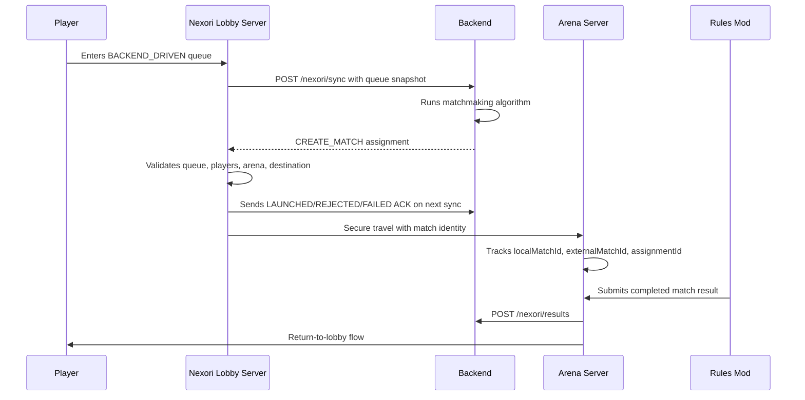

# Backend-Driven Matchmaking

Backend-driven matchmaking lets Nexori execute matches without owning the matchmaking algorithm.

## Ownership

Nexori owns:

- Queue integration.
- Secure travel.
- Match environment lifecycle.
- Return-to-lobby.
- Result reporting transport.

The backend owns:

- Matchmaking decisions.
- Rating and ranking.
- Leaderboards.
- Tournaments.
- Player history.

The rules mod owns:

- Who wins or loses.
- When the match ends.
- Mode-specific stats.
- Objectives and loadouts.

