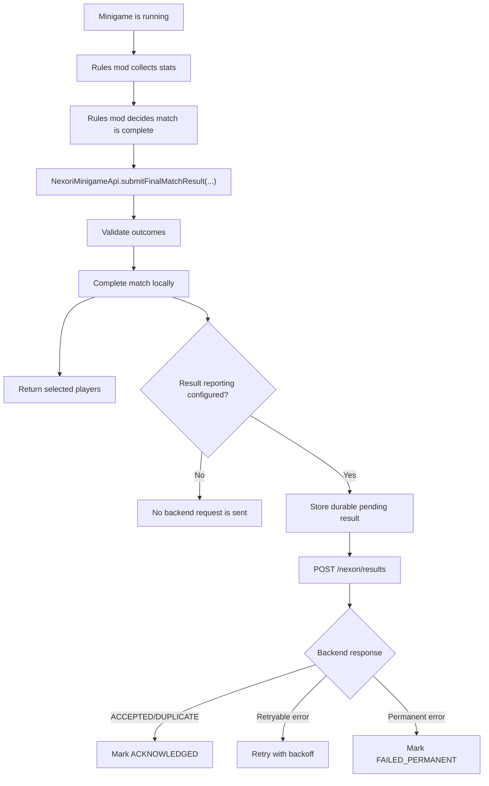

# Result Reporting

Result reporting is event-driven. Arena servers do not need to run matchmaking heartbeat just to report match results.

## Important

`submitFinalMatchResult(...)` completes the match locally even when backend result reporting is disabled.

The rules mod should collect minigame-specific stats while the match is running, then pass them as `customData` when it submits the final result.

Return-to-lobby is intentionally separate. A rules mod can return all players after final result submission, return only eliminated players earlier, or keep eliminated players as logical spectators until the match ends.
