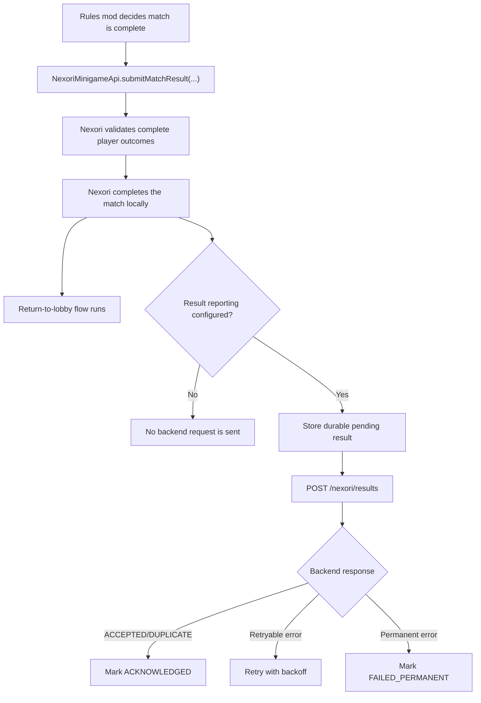

# Result Reporting

Result reporting is event-driven. Arena servers do not need to run matchmaking heartbeat just to report match results.

## Important

`submitMatchResult(...)` completes the match locally even when backend result reporting is disabled.

