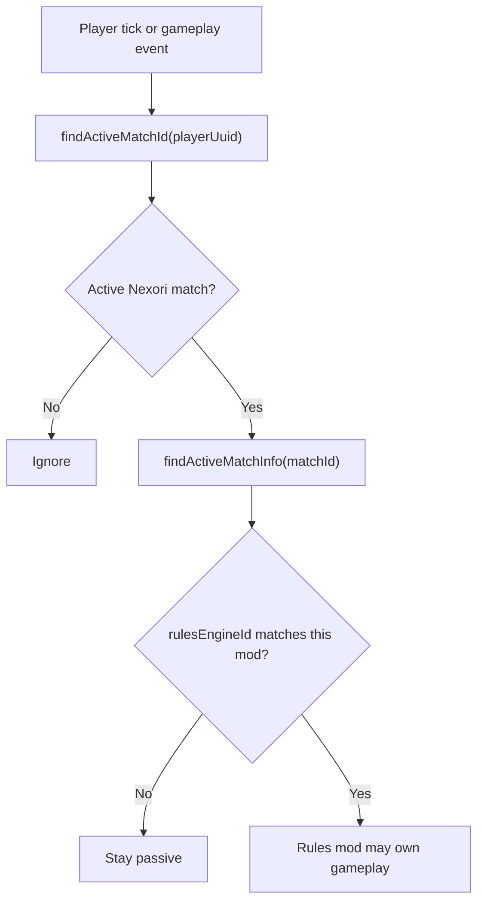

# Rules Mod Ownership

Nexori is the match infrastructure layer. It can launch players into an arena, carry match identity across servers, track arrival and placement, complete local matches, return players to lobby, and optionally report final results to a backend.

Your rules mod is the gameplay authority. It decides which game mode is active, when the match starts, what counts as progress, who wins, who loses, and which stats matter.

## Ownership Boundaries

| System | Owns |
| --- | --- |
| Nexori | Queue handoff, secure travel, arena identity, placement readiness, local match completion, return-to-lobby, backend result transport. |
| Backend | Matchmaking algorithms, ratings, rankings, tournaments, leaderboards, player history, backend-specific policies. |
| Rules mod | Game rules, objectives, scoring, kits, loadouts, AFK or inactivity rules, disconnect policy, final result payload. |

This boundary is intentional. A sword duel, a bed game, a capture mode, and a tournament mode should not need Nexori core changes just because their scoring systems are different.

## Match Authority

A rules mod should only run its match logic when the active match is assigned to that rules mod.

Use `rulesEngineId` to check ownership. In the recommended setup, Manual games require a non-blank `rulesEngineId` in the Games UI, and built-in resolver games keep `rulesEngineId` blank. That means a rules mod can stay simple: if the active match's `rulesEngineId` matches the mod's id, it may control the match; otherwise it should stay passive.

## Placement Handoff

Reaching the destination server is not the same thing as being ready for gameplay.

Nexori may still need to prepare the instance world, assign spawn slots, place players, and finish arrival validation. Use `findMatchPlacementState(matchId)` and wait until `placementComplete` is `true` before starting world-sensitive gameplay logic.

### Why Placement Completion Matters

Nexori's minigame launch flow does more than simply mark a player as connected to the destination server.

At a high level, the flow is:

1. A player leaves the lobby or source server.
2. Nexori routes that player to the destination server using a safe default-world natural spawn entry.
3. On the destination server, Nexori prepares or materializes the instance world for that match.
4. If the instance has configured spawn slots, Nexori prepares those assignments for the arriving players.
5. Once the player is inside the destination world flow, Nexori still validates that the player has completed the initial placement phase for the match.
6. Only after that does Nexori count the player as fully placed.

This matters because "the player reached the destination server" and "the player is fully placed for the match" are not the same thing.

You may briefly see this during travel: a player can appear in a different world before being moved into the minigame instance. That first stop is the safe world Nexori knows the destination server can always provide. If needed, Nexori creates or prepares that safe entry point first, then materializes the match instance and moves the player into the actual arena flow.

Your mod can hit race-condition-style problems if it starts acting on players too early, especially when your gameplay assumes:

- the player is already in the correct instance world
- the player is already at the final spawn location for the match
- all expected players have completed the same placement flow
- Nexori has finished its own initial handoff work for the match

In Nexori's flow, the destination server first resolves a safe default-world natural spawn target. Nexori then prepares the match instance world. If explicit spawn slots exist for that instance, Nexori configures those assignments before the player enters the instance. After arrival, Nexori still tracks whether each player has completed the initial placement phase and only then counts that player as placed.

That is why `findMatchPlacementState(matchId)` is important: it gives your mod a clean handoff point. When `placementComplete` becomes `true`, Nexori has finished its initial arrival-and-placement work for that match. This also covers the case where there are no explicit spawn slots and the flow settles using the instance's natural/default spawn behavior.

Good candidates for the placement handoff:

- starting a countdown
- enabling objective checks
- reading player positions
- opening kits or loadouts
- enabling PvP or match-specific effects
- starting mode-specific timers
- pre-match setup
- minigame initialization
- any system that assumes players are fully handed over to your mod's game flow

## Multiple Minigames On One Server

If several minigame mods run on the same arena server, each mod should isolate its logic by active Nexori match id and by its own mode rules.

Recommended shape:

1. Detect the active Nexori match for the player.
2. Confirm the match's `rulesEngineId` matches this rules mod.
3. Wait for placement completion.
4. Keep match state keyed by `matchId`.
5. Submit one complete result when the match ends.

The important rule is that inactive minigame systems should stay passive. A capture-mode mod should not process a duel match, and a duel mod should not process a capture match. Blank `rulesEngineId` means no external rules mod owns that match in the recommended flow.

## Result Authority

When the match ends, the rules mod submits the complete result through `submitFinalMatchResult(...)`.

Nexori validates accumulated player outcomes, completes the match locally, and then attempts backend reporting only when result reporting is configured and the match has backend identity.

That means local completion does not depend on the backend being online.

Return-to-lobby is separate. After submitting the final result, the rules mod decides which players should return immediately, stay as spectators, or leave later by calling `returnPlayerToLobby(...)`.
