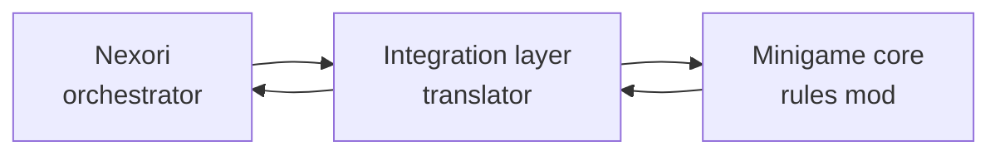
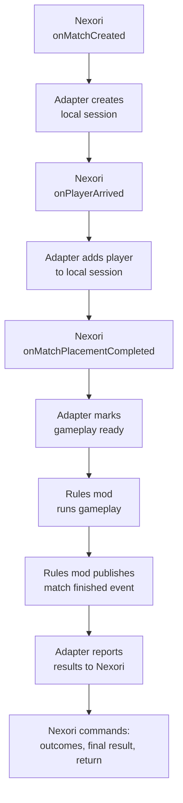

# Integrating Third-Party Minigames

This page explains the integration pattern for third-party Hytale minigame mods that want to work cleanly with Nexori.

## Big Idea

Nexori is the orchestrator.

Your minigame is the gameplay/rule engine.

Your integration layer is the translator.



Nexori handles infrastructure:

- queues
- backend assignment
- match lifecycle
- cross-server travel
- player arrival
- placement
- result reporting
- return-to-lobby
- cleanup

Your minigame handles gameplay:

- game rules
- score/progress
- win/loss detection
- spectators if the game needs them
- HUD/gameplay state
- private gameplay events

The integration layer connects both sides:

- listens to Nexori lifecycle callbacks
- creates or attaches a local room/session in the minigame
- adds players to the local session
- starts or unlocks gameplay after placement is complete
- listens to the minigame's private events
- reports winners/results/returns back to Nexori

## Path A: Direct Nexori Dependency

Use this if your minigame is only meant to run inside Nexori networks.

- Your minigame imports `NexoriMinigameApi`.
- Your runtime can call Nexori commands/queries directly.
- This is simpler.
- Your mod requires Nexori to be installed.

```java
// Simple/direct approach.
// Your rules engine directly calls Nexori.
// This means your mod requires Nexori at runtime.
nexoriApi.setPlayerOutcome(...);
nexoriApi.submitFinalMatchResult(...);
nexoriApi.returnPlayerToLobby(...);
```

This path is acceptable for internal mods, but it couples your gameplay core to Nexori.

## Path B: Optional Integration Layer

Use this if your minigame should load without Nexori, or if you want the cleanest public mod architecture.

- Your core does not import Nexori.
- Your core publishes private minigame events.
- A separate adapter imports Nexori and translates both directions.
- The plugin entry point loads that adapter by reflection only when Nexori is present.
- Nexori is listed under `OptionalDependencies`.
- The adapter registers a lifecycle listener for your `rulesEngineId`.
- The core runs from local session state, not from Nexori polling.



This is the pattern used by:

- `nexori-minigame-template`: the clean starter template for third-party mods.
- `nexori-capture-the-zone-minigame`: the Capture The Zone functional demo.

## Rule Engine Id And Session Ownership

Nexori owns match orchestration. Your minigame owns local gameplay sessions.

`rulesEngineId` is the routing key that tells Nexori which rules/gameplay mod should control a match.

This matters when one arena server has multiple minigame rule engines installed. A SkyWars mod, a capture-point mod, and a duel mod can all be loaded on the same server, but only one of them should take control of a given match. Nexori includes the configured `rulesEngineId` in the match lifecycle snapshots so the correct adapter can create a local session and the other mods can stay inactive.

Choose a `rulesEngineId` that is specific enough to avoid collisions with other mods. Avoid generic ids like `skywars` if your mod might coexist with other SkyWars-style implementations. Prefer a namespaced or branded id such as `my_studio_skywars` or `my_mod_capture_the_zone`.

If your minigame is distributed to other server owners, document the `rulesEngineId` publicly. Server operators need that id when configuring Nexori games, queues, portals, and destinations so Nexori can route players to the correct rule engine.

The integration layer maps Nexori's match lifecycle into your local session model:

- register the lifecycle listener with your `rulesEngineId`;
- let Nexori dispatch match lifecycle events for that id;
- optionally verify `event.rulesEngineId()` inside the adapter as a defensive check;
- create, update, and close local minigame sessions from those callbacks.

Keep `rulesEngineId` handling at the adapter/integration boundary. The gameplay core should not need to know how Nexori routed the match. Once the adapter creates a local session, the core can run from local session state:

- active = local game session exists and is ready for gameplay;
- passive = no local game session exists.

With Nexori:

```text
Nexori callbacks -> integration adapter -> local game session
```

Without Nexori:

```text
local driver or command -> local game session
```

The core should not care which driver created the session.

## Public Nexori Callbacks

Nexori emits semantic lifecycle callbacks so your minigame does not need to poll or guess Nexori-owned match state.

```java
public interface NexoriMatchLifecycleListener {
    default void onMatchCreated(NexoriMatchLifecycleEvent event) {}
    default void onPlayerArrived(NexoriPlayerMatchLifecycleEvent event) {}
    default void onPlayerPlacementConfirmed(NexoriPlayerPlacementLifecycleEvent event) {}
    default void onMatchPlacementCompleted(NexoriMatchLifecycleEvent event) {}
    default void onMatchCompleted(NexoriMatchLifecycleEvent event) {}
    default void onMatchRuntimeClosed(NexoriMatchLifecycleEvent event) {}
}
```

Register with:

```java
NexoriListenerRegistration registration =
    nexoriApi.registerMatchLifecycleListener("capture_the_zone", listener);
```

Close the registration when your integration shuts down:

```java
registration.close();
```

## Callback Meaning

| Callback | Use it for |
| --- | --- |
| `onMatchCreated` | Create or attach your local session/room. |
| `onPlayerArrived` | Add the player to your local session. This is not a raw server connect event; Nexori has associated the player with a match. |
| `onPlayerPlacementConfirmed` | Track individual placement progress, ready state, HUD, or debug state. Do not start gameplay from this alone. |
| `onMatchPlacementCompleted` | Safe point to unlock/start gameplay. |
| `onMatchCompleted` | Usually arrives after your integration called `submitFinalMatchResult(...)` and Nexori accepted or recorded completion. Treat it as confirmation/observation; use it for bookkeeping or logging, not another submit. |
| `onMatchRuntimeClosed` | Clean up local session memory. |

After Nexori has attached a player to your local session, your minigame owns what happens next. For example, if that player disconnects, detect it through your own runtime/Hytale event handling, decide your game's policy, then publish a private minigame event. Your integration layer can translate that event to `setPlayerOutcome(...)` with `LOSS` or `DISCONNECTED`, or do nothing immediately if your game supports reconnect grace. Keep that policy in your minigame; use Nexori commands only to report the outcome you decided.

## Minigame Private Events

Your minigame should have its own private events. They are not Nexori events.

Example:

```java
public record MatchFinishedEvent(
    String matchId,
    UUID winnerPlayerUuid,
    List<UUID> participantPlayerUuids,
    String reason,
    long finishedAtEpochMs
) {
    public MatchFinishedEvent {
        participantPlayerUuids = List.copyOf(participantPlayerUuids);
    }
}
```

Your rules engine publishes the event:

```java
eventBus.publish(new MatchFinishedEvent(
    matchId,
    winnerUuid,
    participants,
    "capture_point_completed",
    System.currentTimeMillis()
));
```

The integration layer listens and calls Nexori:

```java
eventBus.register(MatchFinishedEvent.class, event -> {
    for (UUID playerUuid : event.participantPlayerUuids()) {
        nexoriApi.setPlayerOutcome(...);
    }

    nexoriApi.submitFinalMatchResult(...);

    for (UUID playerUuid : event.participantPlayerUuids()) {
        nexoriApi.returnPlayerToLobby(...);
    }
});
```

Keep this listener out of your gameplay core.

## Optional Loading By Reflection

Your plugin entry point should avoid direct Nexori imports when using the optional pattern.

```java
try {
    Class<?> integrationClass = Class.forName(
        "com.example.myminigame.nexori.MyNexoriIntegration"
    );
    Method method = integrationClass.getMethod(
        "startIfAvailable",
        HytaleLogger.class,
        MyMinigameService.class,
        MyEventBus.class,
        String.class
    );
    AutoCloseable integration = (AutoCloseable) method.invoke(
        null,
        logger,
        service,
        eventBus,
        "my_rules_engine_id"
    );
} catch (ClassNotFoundException | LinkageError missingNexori) {
    logger.atInfo().log("Running without Nexori integration.");
}
```

The adapter can import Nexori normally because it is only loaded when the optional path is available.

## Manifest

For the optional pattern, Nexori belongs in `OptionalDependencies`:

```json
{
  "Dependencies": {
  },
  "OptionalDependencies": {
    "Nexori:NexoriPlugin": "*"
  }
}
```

Compile against the public API artifact with `compileOnly`:

```groovy
repositories {
    mavenCentral()
    maven { url = uri("https://jitpack.io") }
}

dependencies {
    compileOnly("com.github.hyjn-nexori:nexori-api:v2.4.0")
}
```

`nexori-api` is a developer compile-time artifact. Server owners install the full `nexori-plugin.jar` from CurseForge. Do not install `nexori-api.jar` as a server mod, do not use `implementation`, and do not shade or bundle `nexori-api` inside your minigame jar. The installed Nexori plugin provides the API classes at runtime.

## Result Flow

When the minigame ends:

1. The core publishes its own match-finished event.
2. The integration layer maps winners and losers.
3. The integration layer calls `setPlayerOutcome(...)`.
4. The integration layer calls `submitFinalMatchResult(...)`.
5. The integration layer calls `returnPlayerToLobby(...)` when appropriate.

## What To Avoid

| Avoid | Why |
| --- | --- |
| Calling Nexori from the rules engine | Your core will not load without Nexori. |
| Polling Nexori every tick | Lifecycle callbacks already carry the semantic match transitions. |
| Starting gameplay on `onPlayerPlacementConfirmed` | That callback is per-player. Wait for `onMatchPlacementCompleted`. |
| Resubmitting results from `onMatchCompleted` | That creates loops or duplicate reports. |
| Publishing private events while holding long locks | Optional integrations may call back into Nexori. Dispatch outside locks. |
| Exposing your mutable runtime objects as events | Use immutable snapshots or records. |

## See The Implementations

Use these projects as references:

- [`nexori-minigame-template`](https://github.com/hyjn-nexori/nexori-minigame-template): starter architecture for third-party minigames.
- [`nexori-capture-the-zone-minigame`](https://github.com/hyjn-nexori/nexori-capture-the-zone-minigame): Capture The Zone, a working demo that can run with Nexori or in a small local mode without Nexori.
