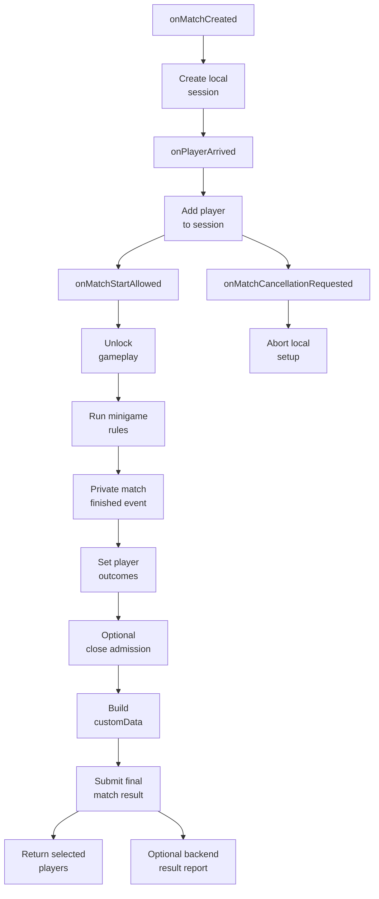

# Recommended Flow

This page shows the result/reporting flow that every Nexori-compatible rules mod should follow.

For optional adapters, start with [Integrating Third-Party Minigames](/public-api/integrating-third-party-minigames). That page explains how Nexori lifecycle callbacks feed a local game session. The command flow below still applies; the adapter calls Nexori commands instead of your gameplay core calling them directly.



## 1. Create Or Attach The Local Session

Your integration listens for `onMatchCreated` and creates a local room/session in your minigame.

```java
public void onMatchCreated(NexoriMatchLifecycleEvent event) {
    service.createOrUpdateSession(
        event.matchId(),
        event.queueId(),
        event.arenaId(),
        event.rulesEngineId()
    );
}
```

Your gameplay core should store runtime state keyed by `matchId`, not by world name alone. A server can host more than one arena lifecycle over time.

The core should consider itself active when a local session exists. It should stay passive when no local session exists.

## 2. Add Players On Arrival

Use `onPlayerArrived` to attach players to your local session.

```java
public void onPlayerArrived(NexoriPlayerMatchLifecycleEvent event) {
    service.addPlayerToSession(
        event.match().matchId(),
        event.playerUuid(),
        event.playerName()
    );
}
```

This callback is not a raw Hytale connect event. It means Nexori associated the player with a specific match context.

## 3. Keep Ownership At The Adapter Boundary

Register the lifecycle listener with your `rulesEngineId`. This id is the routing key that connects a Nexori-configured game/queue/destination to the rule-engine mod that should control the match.

```java
nexoriApi.registerMatchLifecycleListener("capture_the_zone", listener);
```

Nexori uses that id to route lifecycle events to your adapter. The adapter can also check `event.rulesEngineId()` defensively before creating a local session.

Keep the id stable, specific, and documented for server operators. Once the adapter creates the local session, the core should run from that local session state.

## 4. Wait For Start Gate

Arrival is not the same as placement. Nexori may still be preparing the instance, assigning spawn points, and positioning players.

With callbacks, wait for `onMatchStartAllowed`.

```java
public void onMatchStartAllowed(NexoriMatchLifecycleEvent event) {
    service.unlockGameplay(event.matchId(), event.placementState());
}
```

Only start position-sensitive gameplay after the start gate opens. The start gate may open because all expected initial players were placed, or because the initial placement window closed with `minimumInitialPlayers` satisfied.

`onPlayerPlacementConfirmed` is a per-player placement event. Use it for HUD/debug/ready state, not to start the match by itself.

`onMatchPlacementCompleted` is still useful when you care that every expected initial player was placed, but it is not the most general gameplay-start signal once initial placement windows and partial rosters exist.

Handle the opposite branch too:

```java
public void onMatchCancellationRequested(NexoriMatchLifecycleEvent event) {
    service.abortSetup(event.matchId(), event.reason());
}
```

Use cancellation requested to stop countdowns, abort local setup, hide minigame HUDs, cancel timers, and clean runtime state. Do not start gameplay from this branch.

Good things to delay until the start gate opens:

- objective checks
- PvP enablement
- countdown starts
- region/zone checks
- kit application
- spawn barrier removal

## Direct Query Use

Direct integrations, commands, diagnostics, and admin tools can use queries such as `findActiveMatchId(...)`, `findActiveMatchInfo(...)`, and `findMatchPlacementState(...)`.

```java
Optional<String> activeMatchId = nexoriApi.findActiveMatchId(playerUuid);
if (activeMatchId.isEmpty()) {
    return;
}
```

Use direct queries when your code intentionally talks to `NexoriMinigameApi` at runtime. Optional adapters should get match lifecycle state from registered callbacks and feed their own local session model.

## 5. Run Your Minigame Logic

After ownership and the start gate are confirmed, Nexori steps back. Your rules mod owns the mode-specific logic.

Examples:

- SkyWars detects deaths and last surviving player.
- Bed-style modes detect beds broken, respawns, and final deaths.
- Capture modes detect objective progress.
- Duel modes detect combat resolution.

Nexori should not detect custom stats like damage, beds broken, flags captured, assists, chests looted, or capture progress. Store those in your own runtime and send them later as `customData`.

## 6. Accumulate Player Outcomes

When a player's competitive state changes, call `setPlayerOutcome(...)`.

In the optional adapter pattern, your rules engine publishes a private event and the adapter calls this method.

```java
nexoriApi.setPlayerOutcome(
    matchId,
    loserUuid,
    NexoriMatchResultPlayerOutcome.LOSS,
    "fell_into_void"
);
```

For the winner:

```java
nexoriApi.setPlayerOutcome(
    matchId,
    winnerUuid,
    NexoriMatchResultPlayerOutcome.WIN,
    "last_player_alive"
);
```

The last outcome before final submit wins. `LOSS` and `DISCONNECTED` mark the player eliminated in Nexori runtime, while `NO_CONTEST` can be used for no-contest or cancelled outcomes without marking elimination. Outcomes do not return the player to lobby.

## 7. Use Logical Spectator State When Needed

If a player is still in the match context but no longer actively playing, mark them as spectator.

```java
nexoriApi.setPlayerSpectator(
    matchId,
    eliminatedPlayerUuid,
    true,
    "eliminated_can_watch"
);
```

This is logical state. It helps Nexori and other integrations understand player state, but it does not activate a visual camera mode by itself.

## 8. Build Custom Result Data

At the end, build a `JsonObject` with whatever your minigame wants the backend to receive.

```java
JsonObject customData = new JsonObject();
customData.addProperty("mode", "mid_capture");
customData.addProperty("capturePointId", "mid");
customData.addProperty("winnerPlayerUuid", winnerUuid.toString());
```

`customData` is intentionally flexible. Nexori validates size and JSON shape, stores it with the result, and sends it to the backend if reporting is enabled.

## 9. Optionally Close Admission

If the match is backend-driven and your game reaches a point where late joins should stop, explicitly close admission before the final result if needed.

```java
nexoriApi.closeMatchAdmission(
    new NexoriCloseMatchAdmissionRequest(
        matchId,
        NexoriCloseMatchAdmissionReason.ROSTER_LOCKED,
        "Teams are locked for the final phase."
    )
);
```

This is optional. Use it when the match should stop accepting backfill players before the natural policy window closes.

## 10. Submit The Final Result

Once every required player has an accumulated outcome, submit the final match result.

```java
NexoriSubmitFinalMatchResultResult result = nexoriApi.submitFinalMatchResult(
    new NexoriSubmitFinalMatchResultRequest(
        matchId,
        "mid_capture_point_captured",
        customData
    )
);

if (result.matchStatus() != NexoriMatchCompletionStatus.ACCEPTED
    && result.matchStatus() != NexoriMatchCompletionStatus.ALREADY_SUBMITTED) {
    logger.atWarning().log("Nexori rejected result: " + result.message());
    return;
}
```

`submitFinalMatchResult(...)` completes the match locally and optionally queues `/nexori/results`. Local completion does not depend on the backend being online.

## 11. Return Players Separately

Final result submission does not move players. Return is a separate choice.

```java
for (UUID playerUuid : participants) {
    nexoriApi.returnPlayerToLobby(
        matchId,
        playerUuid,
        5,
        "match_completed"
    );
}
```

This separation keeps spectator flows possible: an eliminated player can stay in the arena and return later by command, item, or match end.

## What To Avoid

| Pattern | Why |
| --- | --- |
| Calling Nexori directly from a soft-dependent rules engine | Your core will require Nexori at runtime. |
| Running logic before ownership check | Multiple minigames on one arena server can interfere with each other. |
| Starting gameplay before `onMatchStartAllowed` | Players may not be ready, or Nexori may still be waiting for the initial placement window to resolve. |
| Returning players from `submitFinalMatchResult(...)` | Return is intentionally separate. |
| Sending stats through fixed Nexori fields | Use `customData` for mode-specific data. |
| Re-checking immutable ownership every objective calculation | Cache the accepted match runtime once. |
