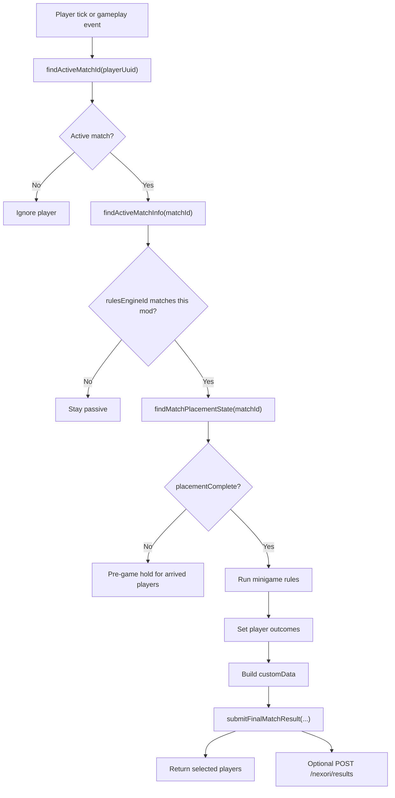

# Recommended Flow

This is the recommended shape for a Nexori-compatible rules mod. The exact class names are yours, but the ownership gates should stay clear.



## 1. Detect The Active Match

Start from a player tick, command, event, or objective check, then ask Nexori whether that player belongs to an active match.

```java
Optional<String> activeMatchId = nexoriApi.findActiveMatchId(playerUuid);
if (activeMatchId.isEmpty()) {
    return;
}
```

Your rules mod should keep runtime state keyed by `matchId`, not by world name alone. A server can host more than one arena lifecycle over time.

## 2. Check Ownership Once Per Match

When your mod first sees a match, read `NexoriActiveMatchInfo` and decide whether this mod owns it.

In the recommended setup, a non-blank `rulesEngineId` means the Game is a manual/custom rules-mod match. The Games UI requires `rulesEngineId` for Manual games, and built-in resolver games should keep it blank. Because of that, your rules mod can use `rulesEngineId` as the ownership gate.

```java
NexoriActiveMatchInfo info = nexoriApi.findActiveMatchInfo(matchId).orElse(null);
if (info == null) {
    return;
}

boolean ownedByThisMod = "capture_the_zone".equals(info.rulesEngineId());
if (!ownedByThisMod) {
    return;
}
```

Cache that decision in your own match runtime. The value is not expected to change during the match, so you do not need to re-check ownership on every gameplay calculation.

If `rulesEngineId` is blank or belongs to another mod, stay passive. This is what lets multiple minigame mods live on the same arena server without stepping on each other.

## 3. Wait For Placement

Arrival is not the same as placement. Nexori may still be preparing the instance, assigning spawn points, and positioning players.

```java
NexoriMatchPlacementState placement =
    nexoriApi.findMatchPlacementState(matchId).orElse(null);

if (placement == null || !placement.placementComplete()) {
    return;
}
```

Only start position-sensitive gameplay after `placementComplete()` is `true`.

When placement is not complete yet, players that already arrived should usually be held in a pre-game state. The exact implementation belongs to the rules mod or arena design: freeze movement if the platform supports it, place temporary barriers around spawn pads, keep gates closed, show a preparing UI, or delay countdown/PvP/objectives until the match is ready.

Be careful with this phase. Some expected players may not have reached the world yet, so do not assume every expected UUID has a live entity that can be moved, frozen, damaged, teleported, or surrounded. Apply the hold only to players that are actually present/placed, and keep checking placement until Nexori reports completion or your game-specific grace policy decides what to do.

This matters for modes like SkyWars, where one player may arrive several seconds before another. Early arrivals should not be able to loot, move into advantage positions, start combat, or trigger objectives while other expected players are still loading into the arena.

Good things to delay until placement completes:

- objective checks
- PvP enablement
- countdown starts
- region/zone checks
- kit application
- spawn barrier removal

## 4. Run Your Minigame Logic

After ownership and placement are confirmed, Nexori steps back. Your rules mod owns the mode-specific logic.

Examples:

- SkyWars detects deaths and last surviving player.
- Bed-style modes detect beds broken, respawns, and final deaths.
- Capture modes detect objective progress.
- Duel modes detect combat resolution.

Nexori should not detect custom stats like damage, beds broken, flags captured, assists, chests looted, or capture progress. Store those in your own runtime and send them later as `customData`.

## 5. Accumulate Player Outcomes

When a player's competitive state changes, call `setPlayerOutcome(...)`.

```java
nexoriApi.setPlayerOutcome(
    matchId,
    loserUuid,
    NexoriMatchResultPlayerOutcome.LOSS,
    "fell_into_void"
);
```

For the winner:

```java
nexoriApi.setPlayerOutcome(
    matchId,
    winnerUuid,
    NexoriMatchResultPlayerOutcome.WIN,
    "last_player_alive"
);
```

The last outcome before final submit wins. `LOSS` and `DISCONNECTED` mark the player eliminated in Nexori runtime, but they do not return the player to lobby.

## 6. Use Logical Spectator State When Needed

If a player is still in the match context but no longer actively playing, mark them as spectator.

```java
nexoriApi.setPlayerSpectator(
    matchId,
    eliminatedPlayerUuid,
    true,
    "eliminated_can_watch"
);
```

This is logical state. It helps Nexori and other integrations understand player state, but it does not activate a visual camera mode by itself.

## 7. Build Custom Result Data

At the end, build a `JsonObject` with whatever your minigame wants the backend to receive.

```java
JsonObject customData = new JsonObject();
customData.addProperty("mode", "mid_capture");
customData.addProperty("capturePointId", "mid");

JsonObject playerCaptureProgress = new JsonObject();
JsonObject winnerProgress = new JsonObject();
winnerProgress.addProperty("playerName", "Janiel778");
winnerProgress.addProperty("progressSeconds", 60.0D);
winnerProgress.addProperty("progressPercent", 100.0D);
playerCaptureProgress.add(winnerUuid.toString(), winnerProgress);

customData.add("playerCaptureProgress", playerCaptureProgress);
```

`customData` is intentionally flexible. Nexori validates size and JSON shape, stores it with the result, and sends it to the backend if reporting is enabled.

## 8. Submit The Final Result

Once every required player has an accumulated outcome, submit the final match result.

```java
NexoriSubmitFinalMatchResultResult result = nexoriApi.submitFinalMatchResult(
    new NexoriSubmitFinalMatchResultRequest(
        matchId,
        "mid_capture_point_captured",
        customData
    )
);

if (result.matchStatus() != NexoriMatchCompletionStatus.ACCEPTED
    && result.matchStatus() != NexoriMatchCompletionStatus.ALREADY_SUBMITTED) {
    logger.atWarning().log("Nexori rejected result: " + result.message());
    return;
}
```

`submitFinalMatchResult(...)` completes the match locally and optionally queues `/nexori/results`. Local completion does not depend on the backend being online.

## 9. Return Players Separately

Final result submission does not move players. Return is a separate choice.

```java
for (UUID playerUuid : requirements.requiredPlayerUuids()) {
    nexoriApi.returnPlayerToLobby(
        matchId,
        playerUuid,
        5,
        "match_completed"
    );
}
```

This separation keeps SkyWars-style flows possible: a dead player can become a logical spectator, stay in the arena, and return later by command, item, or match end.

## Example Result Payload

When backend reporting is enabled and the match has backend identity, Nexori sends a payload shaped like this:

```json
{
  "schemaVersion": 1,
  "resultId": "5a15dffa-fe0e-4c0c-b9ef-33660d58b73b",
  "sentAtEpochMs": 1777789488267,
  "serverId": "25bdb01c-97f2-42d4-998a-4ef7b04d71c3",
  "localMatchId": "3bb28e1b-b83a-459a-ad13-1961acc7759b",
  "externalMatchId": "local-match-000003",
  "assignmentId": "local-assignment-000003",
  "queueId": "capture_the_zone_queue_backend",
  "arenaId": "capture_the_zone_game",
  "rulesEngineId": "capture_the_zone",
  "players": [
    {
      "playerUuid": "b797e79c-6320-42c1-8abe-d4b9dfa35a1f",
      "outcome": "WIN",
      "reason": "mid_capture_win"
    }
  ],
  "reason": "mid_capture_point_captured",
  "metadata": {},
  "customData": {
    "capturePointId": "mid",
    "captureSecondsToWin": 60.0,
    "mode": "mid_capture",
    "placementComplete": true,
    "playerCaptureProgress": {
      "b797e79c-6320-42c1-8abe-d4b9dfa35a1f": {
        "playerName": "Janiel778",
        "progressPercent": 100.0,
        "progressSeconds": 60.0
      }
    },
    "requiredPlayerCount": 1
  },
  "endedAtEpochMs": 1777789488240
}
```

## What To Avoid

Avoid these patterns in new rules mods:

| Pattern | Why |
| --- | --- |
| Running logic before ownership check | Multiple minigames on one arena server can interfere with each other. |
| Treating blank `rulesEngineId` as yours | Blank means no rules mod ownership in the recommended flow. |
| Starting gameplay before placement completes | Players may not be in their final spawn positions yet. |
| Returning players from `submitFinalMatchResult(...)` | Return is intentionally separate. |
| Sending stats through fixed Nexori fields | Use `customData` for mode-specific data. |
| Re-checking immutable ownership every objective calculation | Cache the accepted match runtime once. |
